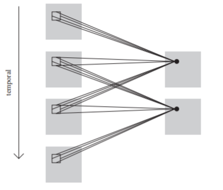
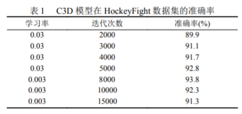
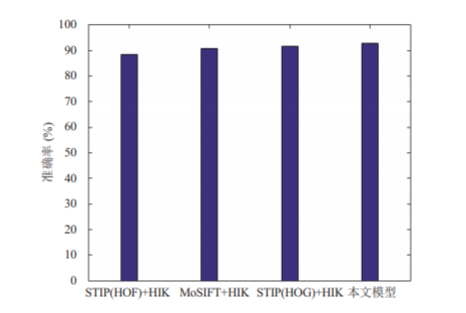
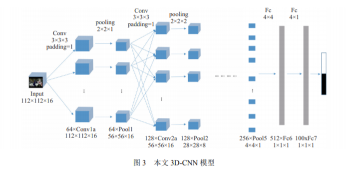
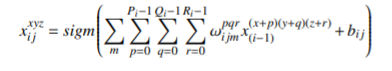
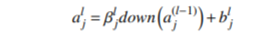

---

typora-copy-images-to: pictures
typora-root-url: ./
---

### 概述

本文提出了“三维卷积神经网络”（3D-CNN）进行暴力检测。

传统的在视频中使用卷积神经网络是对视频中的每一帧用CNN进行识别，但是本文在二维图像的基础上，加入第三维度--时间。这一思想早有人提出，但是作者的创新之处在于，将其使用到暴力检测领域。

下图的示意图就表示在时间维度上的处理方式是，一次性喂多帧图像进去，并提取特征。

### 结果

作者分别在$HockeyFight$和$ATM$数据集进行了测试。

在$HockeyFight$上的数据集表明，当迭代次数为8000次时准确率最高，达到93.8%。

同时，文章与手工提取特征的算法：行为特征描述子 $STIP$ 和 $MoSIFT$,结果显示，本文的模型其准确率最高，且本文采用深度学习的方法，省去了手动提取特征的步骤，更加高效。

文章也采用了模型融合，实验结果表示： RGB+FLOW 模型的融合最高准确率高于基于RGB构建的3D-CNN模型。证明了模型融合在一定程度上可以提高准确率。

在$ATM$数据集上的对比实验也证明了本实验具有较好的性能。

### 技术细节

#### 3D-CNN模型

文章所提出的深度学习模型有8个卷积层、5个池化层、2个全连接层、一个SoftMax层。

所有的3D卷积核大小是$3*3*3$的,时空步长都是1，Padding为1。除了Pool1的滤波器是$1*2*2$的，其余的池化层滤波器均是$2*2*2$的。

卷积层，采用卷积核作用于输入层，一共有64种不同的卷积核，所以得到64个不同的特征map。计算过程如下：

降采样层，即池化层1采用$2*2*1$的步长对特征图进行降采样。降采样函数down选择最大池化法。

之后的卷积层2和池化层2采用的连接方式和计算方法同第一层。

之后层数是2个卷积层一个池化层。

第5个池化层后是两个全连接层，一个dropout层防止过拟合，一个SoftMax层进行分类。

#### 模型融合

对原始的RGB图像帧进行提取光流信息处理，得到光流图谱。将光流图谱作为3D-CNN模型输入，来提取图像光流图谱的特征，最后训练模型的方法。

文章采用的计算光流的算法是$Lucas-Kanade$ 算法。