## 机器学习（吴恩达系列课程）

### 1-2什么是机器学习

在没有明确设置使的情况下，计算机具有学习能力的研究领域。  --Arthur Samuel

计算机从经验E中学习，解决某一任务T，进行某一性能度量P,通过P测定在T上的表现因经验E而提高。 	--Tom

机器学习分为监督学习和无监督学习两类。

>监督学习：正确的答案已经被给出了、教会计算机做一些事情
>
>无监督学习：不会告诉计算机正确的答案或者分类、让计算机自己学会做一些事情

### 1-3 监督学习(supervised Learning）

回归问题（Regression ）:预测连续的数组输出的问题。

分类问题(Classification):  具有离散的输出值（0 or 1）

eg：预测房价的问题是一个监督学习、回归问题。

预测一个肿瘤是良性还是恶性是一个监督学习、分类问题(Classification)

### 1-4 无监督学习（Unsupervised Learning）

聚类问题：给定一个数据集，判断那些数据属于一个集合。

鸡尾酒问题：将不同的音频拆分开。

eg：Google等搜索引擎的页面，相似的话题会聚在一起、DNA检测、对客户分类、天文分析等都属于聚类问题。

### 2-1 模型描述

对于训练集，通过机器学习算法，训练出能很好的拟合训练集数据的假设函数h。

对于给定的输入x，就可以用h来预测想要得到的输出值y。

### 2-2 代价函数(Cost function)

为了能够更快地选择出参数使得假设函数能够更好的拟合数据，定义预测值和真实输出值之间的误差为代价函数。

可以使用均方误差作为代价函数，也可以是其他的函数形式。一般来说，线性回归问题常使用均方误差，而分类问题一般不使用均方误差。

### 2-3 代价函数（一）

为什么使用代价函数？

我们希望找到一条与数据拟合的直线，我们构造了假设函数h，包含两个参数。

随着所选择的参数不同，将会得到不同的直线。

代价函数就是我们要优化的目标。

从下述的列子可以看出，当代价函数最小时，模式和数据能够最好的拟合。这时的假设函数也就是最拟合训练集的数据。

所以，代价函数最小时的参数值确实是我们想找的最优参数值。可以将代价函数作为我们的目标。

### 2-4 代价函数（二)

如下图，当改变参数的取值时，代价函数（纵轴）的值也会发生变化。当代价函数最小时，参数最优

### 2-5 梯度下降

梯度下降用来找到代价函数最小时的参数值的方法。是优化参数的一种方法。

工作原理是：从某一参数开始，通过改变参数值，不断地减小代价函数的值，最终得到局部或者全局代价函数最小值。

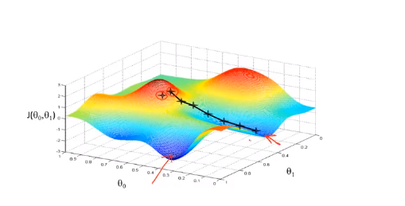

从图看出：不同的初始值，最后可能会有不同的参数取值。

梯度下降的实现如下：

​								·     

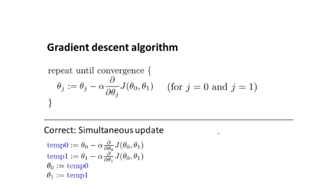

其中，必须同时更新各个参数的值。

反复该算法执行，直到函数收敛。但是得到的可能是局部最优，而不是全局最优值。

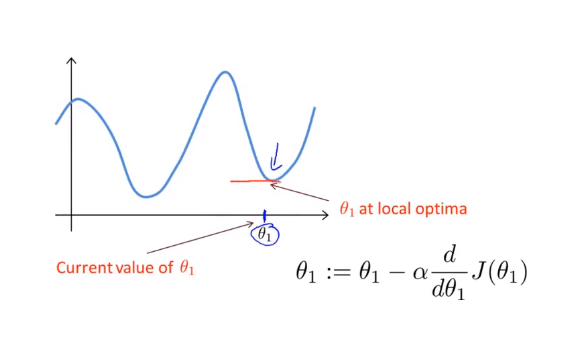

a是学习率，决定了梯度下降时的步长，也就是每一次参数改变的量。学习率太小，收敛过慢；学习率太大，函数可能会无法收敛。

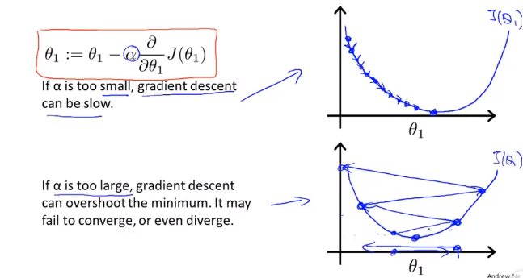

导数项是代价函数关于某一当前参数的导数，在图像上就是代价函数在此处的坡度/斜率。导数为正，参数减小；导数为负，参数增加。最终参数都是向代价函数最小的方向靠近。

### 2-7 线性回归的梯度下降

用==梯度下降==方法来求解==线性回归==的最小代价函数。

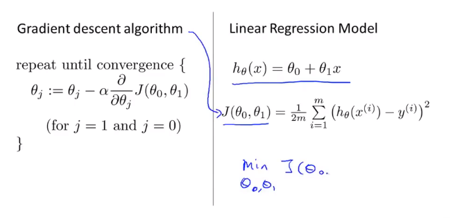

将线性回归中的代价函数J带入梯度下降中进行求导，化简结果如下所示：

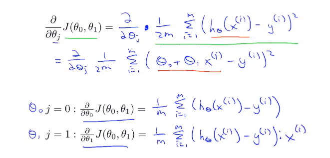

并将化简后的值带入梯度下降的公式中，得到：

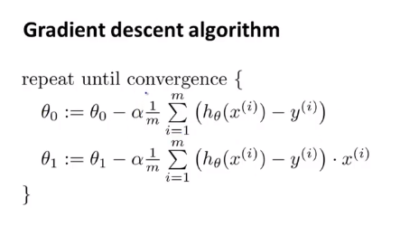

通过上式来同步的跟新两个参数。

线性回归的代价函数总是一个凸函数（如下图所示），也就是说：当用梯度下降法求解线性回归问题的时候，不会陷入求得局部最优解的误差当中去。

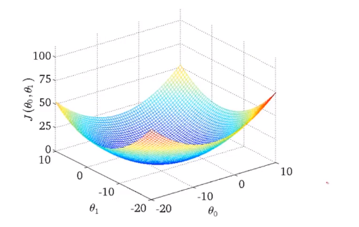

像这样，梯度下降每走一步，都会遍历整个样本空间的算法，也叫做“Batch“梯度下降算法。当然，并不是所有的机器学习算法每跟新一步要遍历整个样本空间，有些算法只需要用到所有样本的一个子集。

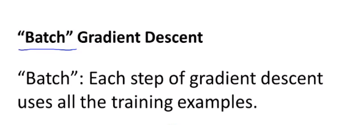

相比于正规方程法，梯度下降法更适合于大量的样本数据时的求解。

### 3 线性代数相关知识复习

该章笔记详见GoodNote，改处不再赘述。

该章主要讲了矩阵、向量的含义、表示、基本运算和性质；矩阵的逆和转置等等。

### 41 - 4-2  多特征的线性回归

当样本的特征不止一个时，我们用小标$$i$$来表示样本$$j$$的第$$i$$个特征。

下例【预测房价】中，当输入样本的特征值含有：面积、卧室数量……

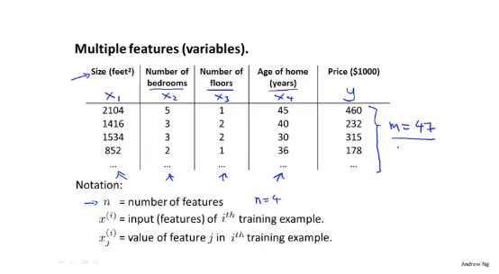

当特征值变多时，假设函数的形式会发生改变，要包含所有的特征参数。假设函数化简形式如下：

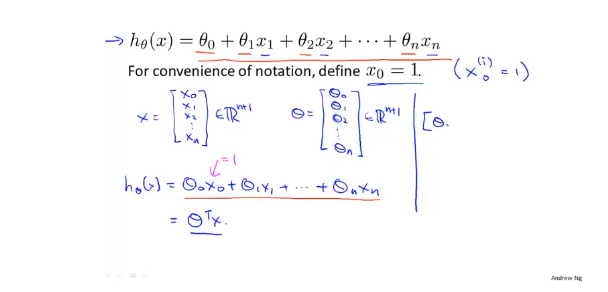

对应的多特征时的代价函数如下：

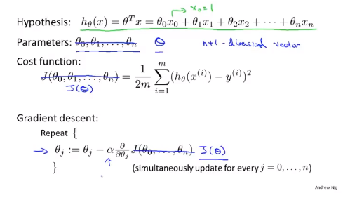

其梯度下降的函数变为下面的形式： 

### 4-3 多元特征之特征缩放

feature scaling ：确保所有的特征都在一个相似的范围里面。

当两个特征值的范围相差较大时，代价函数的收敛速度会比特征值范围相近时慢很多。

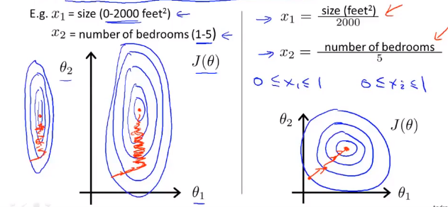

一般的，我们会使得每个特征的范围在$$-1<=x_i<=1$$,但是如果范围是$$-3<=x_i<=+3$$也是ok的。

==均值归一化==Mean normalization：

使得每个特征值具有为0的平均值。特征值减去平均值再除以最大值。

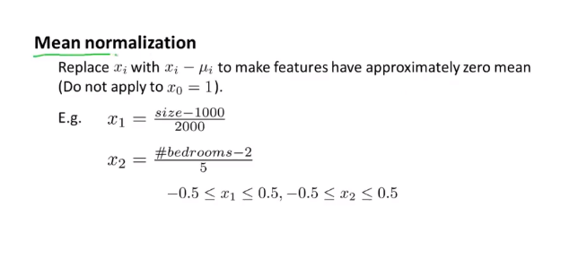

### 4-4 多元特征之学习率

通过绘制并查看J-times 曲线来观察是否随着迭代次数的增加，j的值在不断变小，依次来查看梯度下降算法是否正常工作，以及可以依靠图像来查看函数是否已经收敛；也可以通过判断每次J的值的变化是否小于阈值（$10^-3$）来判断是否收敛。

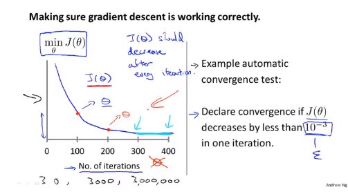

如果假设函数J随迭代次数的上升而上升或者时而上升时而下降，则有可能是由于学习率太小的缘故。数学证明：只要学习率足够小，则J一定会随着迭代次数的增加而下降的。

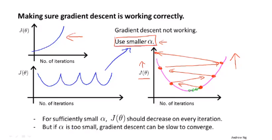

学习率太大或者太小都会有问题，我们应该不断地尝试学习率的值。可以从0.001开始，0.003、0.01、0.03、1……来尝试学习率的值。这样我们会得到一个在可以正常收敛情况下的最大的学习率。也就是说在可以收敛的情况下，尽可能的使下降的步伐变大，增快收敛的速度。

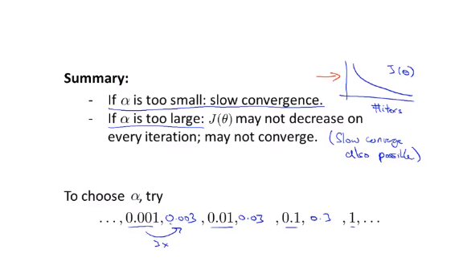

### 4-5 特征和多项式回归

房屋关于面积的预测假设函数如果只是用一次或者二次函数来拟合的话，会有很大的误差。可以用三次的多项式函数来预测。

当使用三次多项式函数时，可以将x当做$$x_1$$,$$x^2当做x_2$$，$x^3当做x_3$,则可以将多项式函数转化为线性函数，利用之前学过的线性回归来求解。

需要注意的是：使用该方式时，特征缩放尤为重要。

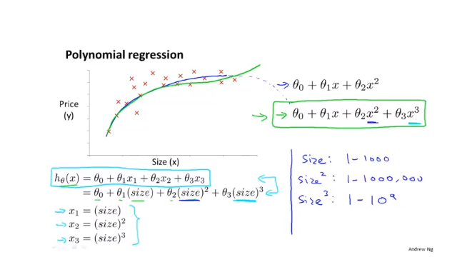

在这个例子中，取根号比二次要更为合理一点。所以，应该根据实际情况选择合适的特征。

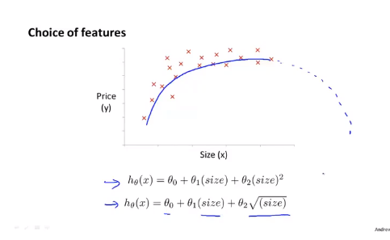

### 4-6 正规方程

正规方程是不同于梯度下降的另外一种求解代价函数最小时的参数时的一种方法。

我们使用梯度下降的目的是为了找到代价函数的最小值，那么，如果直接用代价函数对参数求导，使得导数值为0，则可以直接得到想要的参数。

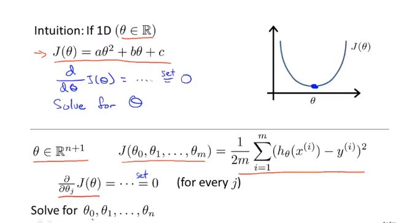

例如，有四个样本，我们构造$$X$$矩阵，表示样本，其中一行表示一个样本，一列表示一个相同的特征值，向量y表示4个样本的实际的房屋价格值。

则可以使用下述的方程求解参数矩阵，证明过程略。

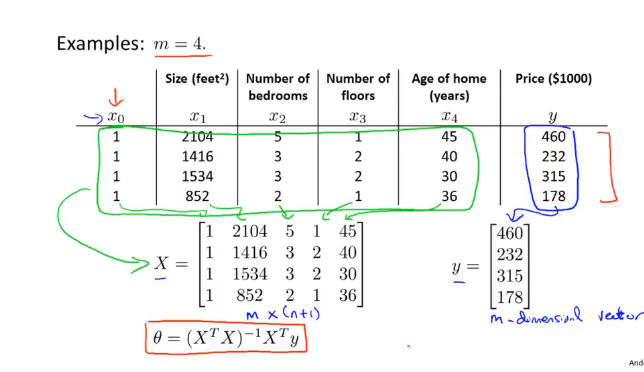

相比于梯度下降，特征方程法不需要选择学习率、不需要啊迭代。但是当样本数据m非常大的时候，梯度下降仍然能够很好的工作，但是对于特征方程，矩阵求逆的时间复杂度是$$O(n^3)$$。（当n<10000时，梯度下降和特征方程法都是ok的，但是当n大于1000时，特征方程法太慢，应考虑梯度下降法）

### 5 编程语言

是Octave编程语言，所以暂时跳过了。

### 6 逻辑回归之分类问题

分类问题举例：

一般情况，对于二分类问题，预测值的结果是0或者1，并且0表示没有，1表示有。对于多分类问题，也可以用0、1、2、3……表示。

首先考虑使用线性函数来拟合数据集。那么当$$h_t(x)$$大于等于0.5，表示预测值为1，小于0.5，表示预测值为0。

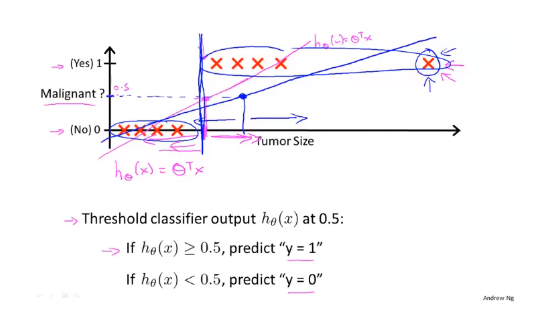

如果依旧使用线性回归的假设函数来预测这个二分类问题，那么，当增加了最右面的那个样本之后，假设函数将会从洋红色的线变成蓝色的线，虽然，对于新增加的那个样本来说，模型对他的预测依旧是准确的，但是显然，蓝色的线对于左边的一些数据是不合理的。

通常来说，将线性回归使用到分类问题，并不是一个很好的注意。

### 6-2 逻辑回归之假设函数

对于分类问题，我们所需要的输出通常是0或者1，但是假设函数的输出通常是会大于1或者小于0的。

我们可以使用sigmoid函数（或者logistic函数），将其作用于线性回归的假设函数的输出，这样就会将原本假设函数的输出值映射到0-1区间。$$h_0(x)$$表示的是对于输入样本x使得$$ y=1$$的概率大小。

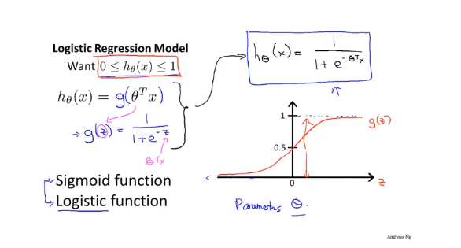

### 6-3 逻辑回归之决策边界

对于二分类问题，当假设函数的参数确定时，样本可以根据假设函数预测值大于等于0还是小于0分为两块。

这条将划分区域的线就是决策边界。他是假设函数的性质，与样本存在与否没有任何关系。

上述是当假设函数为一次时的决策边界，下面是当假设函数为高阶时的决策边界。随着假设函数中多项式的复杂多变以及参数选择的变化，我们可以得到不同的决策边界。

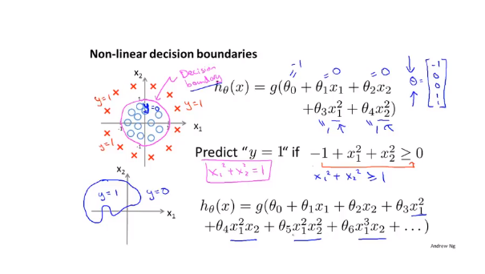

### 6-4  逻辑回归之代价函数

对于下述的条件，我们有m个样本和假设函数，如何选择参数呢？

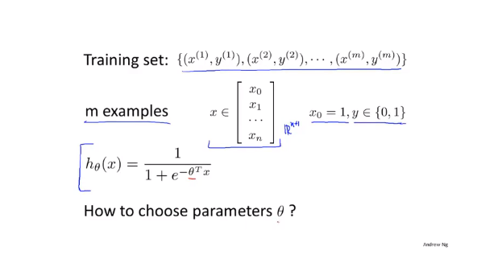

在线性回归中，我们选取的代价函数时平方差之和除以m，对于逻辑回归而言，其假设函数是非线性的，这时，如果继续采用原来的均方差做代价函数，得到的代价函数关于参数的函数是非凸的。那么，就无法使用梯度下降来求得最优值。

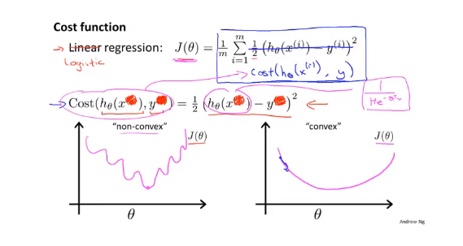

因此，我们不使用均方差作为逻辑回归的代价函数。而使用下述的log函数。

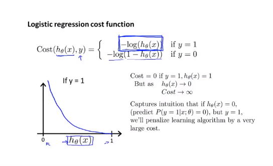

当y=1，预测值越靠近1，代价函数值越小。预测值为1时，代价函数为0；预测值为0时，代价函数值接近无穷大。

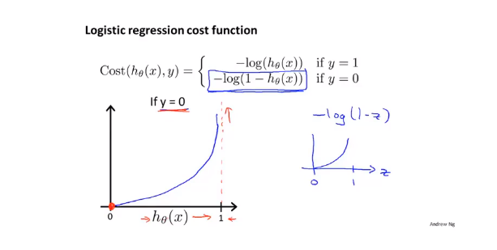

y=0时，预测值越靠近0，代价函数值越小；预测值越靠近1，代价函数的值越大。

### 6-5 简化代价函数和梯度下降

为了后续用梯度下降时对代价函数求导时，不用分情况讨论，将逻辑回归的代价函数简化为下述的形式：

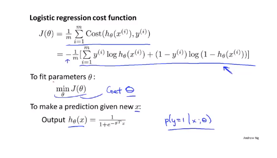

有了代价函数，如何利用梯度下降求解最优参数呢？

将代价函数求导，并直接用梯度下降法求解。

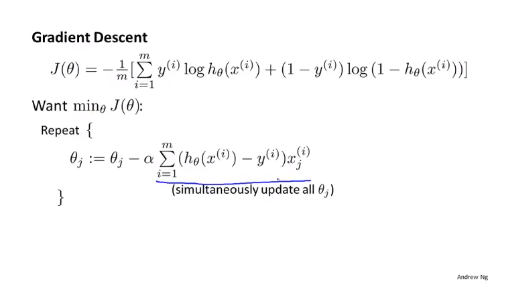

我们发现，逻辑回归的梯度下降式子和线性回归的式子是一模一样的，但是，这两个式子其实并不相同，因为其中的假设函数不相同。

### 6-6 高级优化

除了梯度下降，还有一些其他的方法可以求解最优的参数。相比于梯度下降，这些方法更加高效，也更加困难。

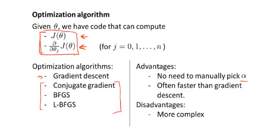

### 6-7 多元分类

当分类问题中，最后需要分成的类别大于2时，这就是一个多分类问题。

如下图，是一个三元分类问题，我们可以训练三个分类器，在第一个分类器中，第一种样本为正样例，其余为负样例；第二个分类器中，第二种样本为正样例，其余为负样例。

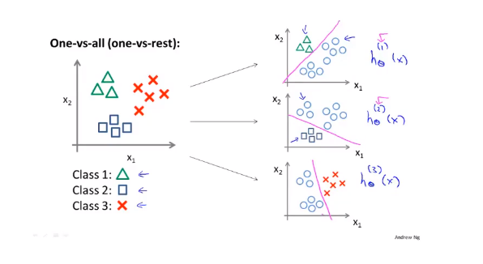

当我们有一个输入x时，将其分别输入到三个分类器中，最终，预测值最大的那个分类器就是对应的预测结果。

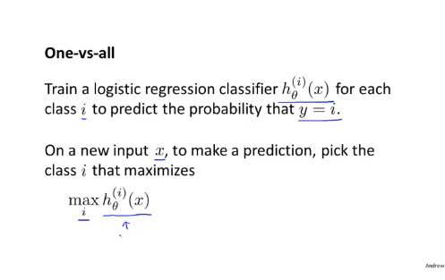

### 7-1 过拟合问题

如下图所示，对于给定的样本集，当多项式次数足够高，多项式足够复杂时，模型虽然能够很好的拟合数据，但是已经失去了意义。

这种情况叫做过拟合或者高方差问题。过拟合现象通常发生在样本集较少，但是样本特征较多的情况。

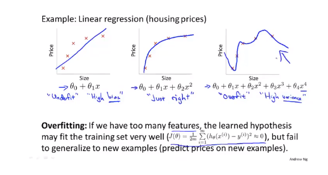

对于分类问题，也可能存在过拟合的问题。

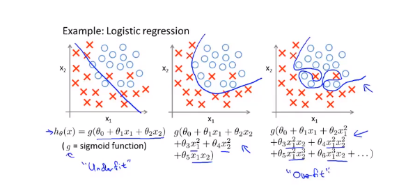

当发生过拟合的问题时，如何解决呢？

一种方法是绘制假设模型曲线，直观地观察模型是否存在过拟合的现象。但是当特征值不值一个的时候，绘图会变得很困难。

可以通过人工选择一些重要的特征，舍弃一些特征来解决过拟合的问题，也可以采用一些算法来自动选择特征。

但是在舍弃一些特征的时候，也舍弃了一些信息，可能会影响模型的准确性。所以，常用的一种方法是**正则化**，对每个参数加一个惩罚因子，缩小参数的值。

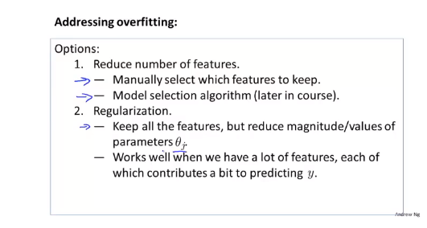

### 7-2  正则化之代价函数

如下图所示，当我们在代价函数中对高阶的参数前面加一个大系数时，在使得代价函数趋于0的时候，theta3和theta4都会趋向于0，于是，假设函数的形式就会像下图二中的粉色线条一般。

正则化的思想正是对参数加以惩罚，以避免过拟合现象。

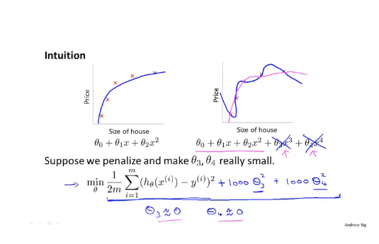

因为实际操作的时候，我们并不知道应该选择哪些参数来加惩罚。所以通常可以对除了theta0之外的所有参数都加以惩罚。可以在代价函数的后面加入一项来实现。

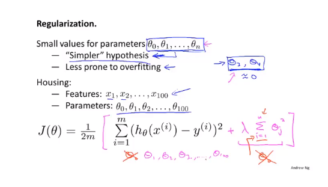

当参数lambda太大的时候，也就是说，除了theta0之外的所有参数都接近0，所以这时，模型会出现欠拟合的现象。

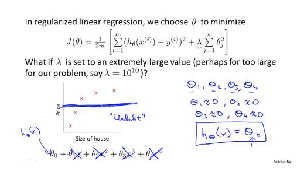

### 7-3 正则化之线性回归

对于线性回归梯度下降，将theta0单独写，其他参数的对应的式子进行改写。得到如下图所示的式子。

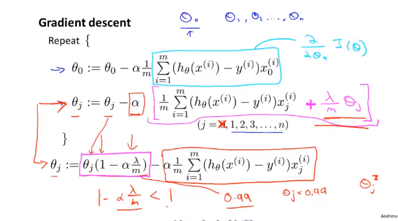

有趣的是，上述图最后一个式子表明，正则化的过程，本质就是每次更新将参数时将原本算出来的参数$theta_i$减小一点点。

对于正规方程法，也可以使用正则化的思想，具体公式如下图所示。该出不做证明。

### 7-4 正则化之逻辑回归

对于逻辑回归问题/分类问题，也可能会存在过拟合的问题，那么，我们也可以用相似的方法对参数加惩罚。

如下图，在代价函数的后面加上一项。

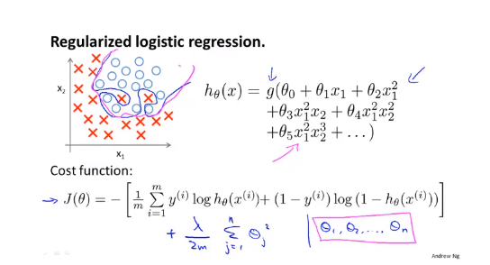

当利用梯度下降对其求解的时候，得到下述的公式，此处的公式与正则化线性回归也是完全相等的，但是，因为公式中的假设函数不同，所以这时两个完全不等的函数/过程。

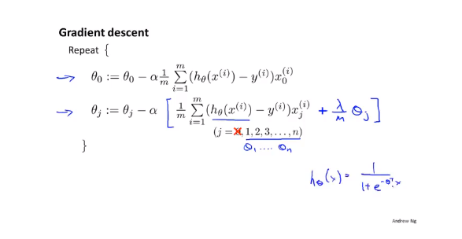

### 8-1 非线性假设

考虑一个监督学习、非线性问题。

假设函数是sigmoid函数加上多项式的形式。

例如，房价预测问题。假设我们现在有多达100个特征，那么，如何构造特征呢？

如果只是考虑二次项，将会有5000中选择，我们也可以只考虑平方项，这样的话，二次项就减少到了100个，但是只能画出椭圆，而不能画出更加复杂的图像。

如果加上一次项和三次项、四次项……等高次项，我们要考虑的特征将会十分多，模型将会十分复杂。

所以，当特征个数急剧增加时，通过增加特征来建立非线性分类器并不是一个好的做法。

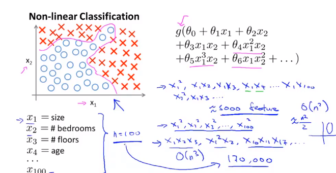

对于一个将图片分类为是汽车和不是汽车两种的例子，拿一张50*50像素的图像，单是以图像的像素值为特征就可以构造出一个2500维的特征向量。

那么，二次项就有2500*2500 约为300万项。

显然，这个数量太大了。

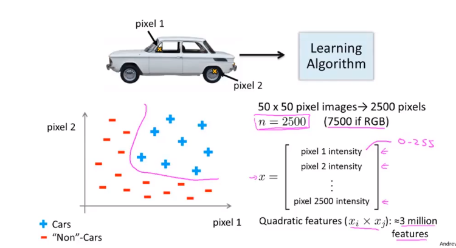

因此，简单的逻辑回归算法并不是一个当n很大时学习复杂的非线性假设的好办法。因此，我们引入神经网络。

### 8-2 神经与神经元

让机器学会学习。

生物学知识略过。

### 8-3/4 神经网络表示之模型展示

sigmoid 激活函数 是 sigmoid函数或者logistic函数的别称。权重weight或者参数parameters是一个东西。

对于如下所示的神经网络，左边是其内部的式子，右边是其向量化实现。

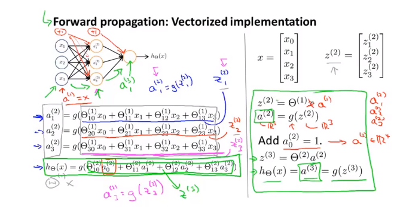

如果看从隐层到输出层，我们可以发现，这个过程本质是一个逻辑回归的过程。但是，这个逻辑回归中所使用到的特征不是X，而是来自隐层的值,是经过从输入层到隐层的训练得来的。

所以，该神经网络实现了自己训练特征值的功能，当theta1不断改变时，可能会得到十分有趣和复杂的特征。

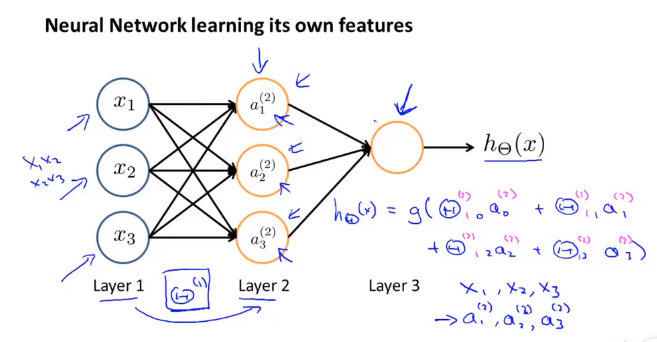

### 8-7 神经网络之多元分类

对于一个将图像分类，产生多个类别的多元分类问题。

我们可以建立一个含有4个输出神经元的神经网络，

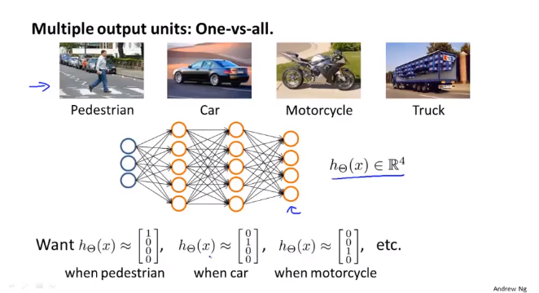

对于每个输入的图像的特征x，我们得到一个四维的向量来表示其分类。

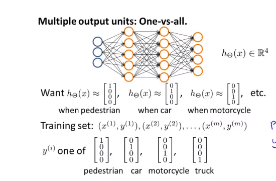

### 9-1 神经网络之代价函数

我们将分类问题分为2类，Binary Classification 和 Muti-class classification。对于第一类，我们只需要一个输出神经元，对于第二类，我们需要k个，k表示需要分类的类别数。

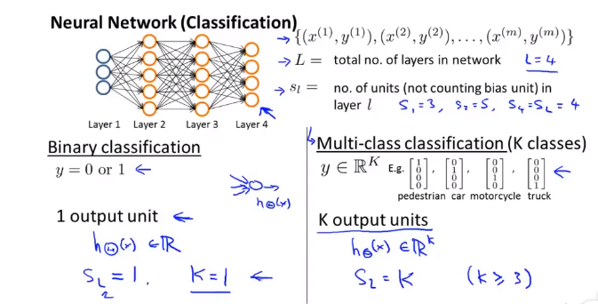

对于逻辑回归而言，其代价函数如下，对于现在的神经网络而言，输出可能有k个，所以我们在原先逻辑回归的基础上稍作改变得到新的代价函数，每次要对k个输出都要计算其与真实值y之间的误差，并且正则化项也囊括了所有的参数。

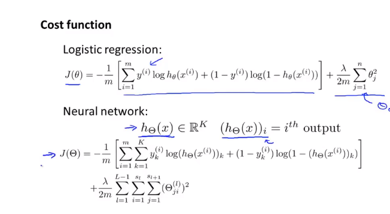

### 9-2 神经网络之反向传播

现在我们有了神经网络的代价函数，如何利用梯度下降或者其他的一些高阶算法来求解参数呢？

我们首先考虑只有一个训练样本的情况。

其正向传播的过程就是算假设函数值的过程如下：

接下来看反向传播的过程：

设$delta^l_j$是第$l$层、第$j$个节点值与真实值之间的误差，则$delta^4_j=a^4_j-y_j$，再利用下述的式子将误差向前传播。那么，我们就可以粗略的利用$a^l_j * delta^{j+1}j$来计算代价函数对参数$theta^l_{ij}$的导数,

接下来考虑有m个样本时的情况。

首先有一层m个的循环，针对于每一个样本。

对于每一个样本，首先利用正向传播计算预测值，然后利用反向传播计算误差值，最后，将$a^l_j * delta^{j+1}j$累加。

跳出循环之后，利用下述的式子计算$D^l_{ij}$,数学证明，$D^l_{ij}$也就是代价函数关于参数$theta^l_{ij}$的导数。

### 9-3 神经网络之反向传播

现在来直观地理解反向传播，其过程跟正向传播类似，只是方向相反。

$detal^l_{ij}$，等于第$l$层第$j$个节点指向第$l+1$层第$i$个节点的参数乘以第$l+1$层第$i$个节点的$detal$值累加和。

该过程与正向传播求解激活函数的过程相似。且参数$theta$相同，只是传播的值不同。

当求出所有的$detal$值后，利用第$l$层第$j$个节点的激活值乘以第$l+1$层第$i$个节点的$delta$值，来计算代价函数对参数$thlta^l_{ij}$的导数。

### 9-5 梯度检测

暂时跳过

